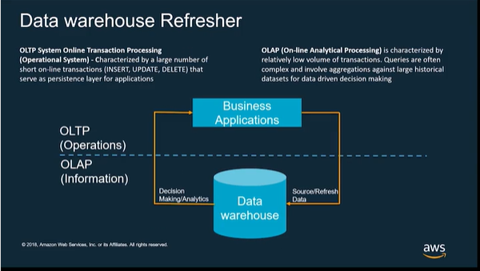

# Data-Engineering-and-Analytics-with-AWS
This is based on my experience working with AWS, resources available in AWS - Data Analytics Fundamentals and my curious web searches.

## Architecting on AWS
When architecting our system *Compute* and *Storage* should be separated. We should use
- the open data formats like apache parquet, Avro, ORC. etc. I have mostly use [parquet](https://github.com/paramraghavan/Data-Engineering-and-Analysis-with-AWS/blob/main/parquet.md), but in some cases csv as that was the consumers requirement or what the upstream producer delivers.
- The data should not be replicated but shared across team, such that the same data is used by marketing team for sql query and is used by data scientist to run their model
- Also take into consideration the  5 Vs: **volume, velocity, variety, veracity, and value**. 
  - **Volume**, is the amount of data that a solution must handle. 
  - **Velocity**, is the speed at which data enters and flows through your solution. Many businesses now use large volumes of real-time streaming data. Solutions must be able to rapidly ingest and rapidly process this data. 
  - **Variety**, ingesting data of many different types from many different sources can mean many different challenges to data analysis. Smart companies build solutions to work with structured, semistructured, and completely unstructured data types. 
  - **Veracity**, which refers to the trustworthiness of your data, trustworthiness means - you know the chain of custody for that data. That you can say with certainty that the data has not be altered falsely. Collecting data is easy—making sure it’s accurate and consistent? That's the hard part—that’s veracity. 
  - **Value**, is the bottom line, really. The whole point of this effort is getting value from data. That includes creating reports and dashboards that inform critical business decisions. It also includes highlighting areas for improving the business. And it includes making it easier to find and communicate critical details about business operations.
- Data can be structured, semi-structed , unstructured

## Lifecycle of data

## Data Source
- S3
- On premise database
- file system
- IOT devices
- streaming data example IOT devices
- public dataset to enrich data sources
- etc

## Ingestion Layer
- AWS Custom Data Migration Service for on premise databases
- AWS Kinesis Kinesis Analytics for IOT devices, data streams. Kinesis Analytics - continuously reads and process streaming data in real time, (You write application code in a language supported by Apache Flink) to process the incoming streaming data and produce output. Then, Kinesis Data Analytics writes the output to a configured destination, in our case S3
- AWS Glue Crawler
- AWS Snowball - used for one time bulk transfer from on premise to S3
- Custom code  processing includes collecting, cleaning, transforming, and loading data into an analytic data store using for example Java or python code which moves data from on premise to S3 or S3 to S3.

## Storage
- S3, this is used for storage and data here should be not be replicated but should be shared across accounts.

## Analyze
- Redshift/Redshift spectrum to read unstructured data in S3
- Use Athena for sql analysis of data on S3
- We can use the AWs Glue to create data catalog over the S3 files, which can be accesed via sql, for example we can use the spark sql serverless container to access glue mappings/data catalog to perform sql
- Amazon EMR - running spark sql to access glue datalog on to of s3

## Visualize
- Quicksight for reporting purposes. Quicksight has in memory database called spice , this provides a persisten store for calculated data, ths is specially useful for reports that do not chnage very frequentlya nd provide good response to the users
- Reporting tools like microstratergy, tableau can use the Redshift spectrum tablesand view for reporting 
- D3js, pyflask and  redshift spectrum tables - accessed via redshift driver

## Data Governance with [datalake](https://github.com/paramraghavan/Data-Engineering-and-Analytics-with-AWS/blob/main/datalake/datalake.md)
Once we decide  we are going to use S3 as a  central datastore aka datalake or a  single source of truth, we need a mechanism for producers and consumers to register their respective data and we can call it dataset.  All those who need to consume from S3 have to register as a consumer of the data and the producer as  source of the data. The producer will publish the metadata for the data, volumne, veracity, source, variety, data registered date, end registered date, email of the team etc. The data governance should be fully automated with  daily proessing running some kind of automatic validation and flag out concerns via email to the respective teams. May be glue crawler can help you get started with a rudimentary metadata.

# OLAP v s OLTP

## In detail
- [datalake](datalake/datalake.md)
- [Kinesis Streams](kinesis_streams/kinesisstreams.md)
- [data and more](data.md)
- [parquet and more](parquet.md)

References:
- http://diagramo.com/editor/editor.php
- https://explore.skillbuilder.aws/learn/signin - Data Analytics Fundamentals
- [Build ETL pipeline to load data incrementally from Amazon S3 to redshidt using Glue](https://docs.aws.amazon.com/prescriptive-guidance/latest/patterns/build-an-etl-service-pipeline-to-load-data-incrementally-from-amazon-s3-to-amazon-redshift-using-aws-glue.html)
- https://www.diagrameditor.com/
- https://www.microsoft.com/en-us/p/drawio-diagrams/9mvvszk43qqw?activetab=pivot:overviewtab

# Interesting Reads
- https://eng.uber.com/

